# ♻️ RecycleRiti

A simple waste management app to schedule waste pickups, track pickup agents live, participate in events like donations and neighbourhood cleanup activities, and promote recycling.

## 🛠️ Tech Stack
- Flutter  
- Node.js (Express.js) 
- PostgreSQL  

---

## 🚀 Features
- Schedule recycling pickups  
- Live agent tracking  
- Notifications & updates  
- Pickup confirmation  
- Join events near me
- User & agent dashboards  

---

## ⚙️ How It Works
1. Sign up  
2. Schedule pickup (date & time)  
3. Agent accepts request  
4. Track pickup live  
5. Pickup completed & confirmed  
---

## 📱 Screenshots

  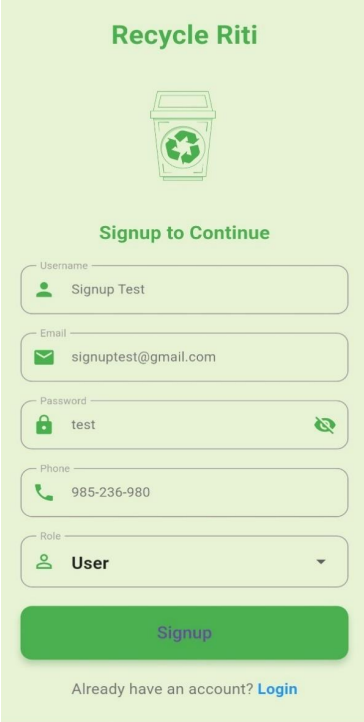
  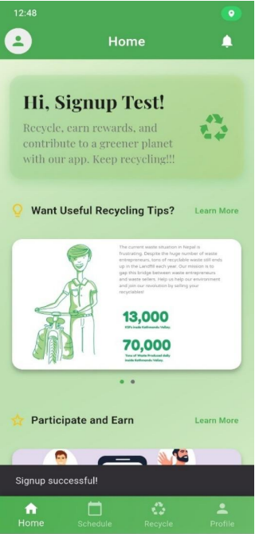
  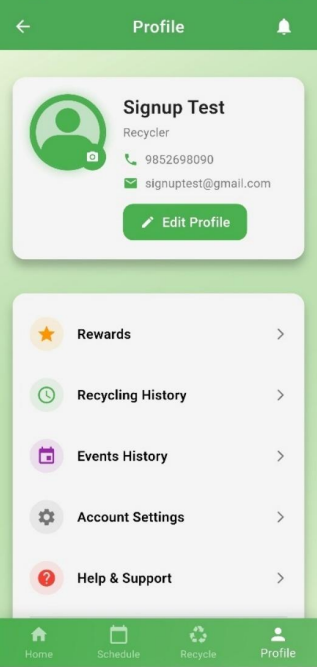

  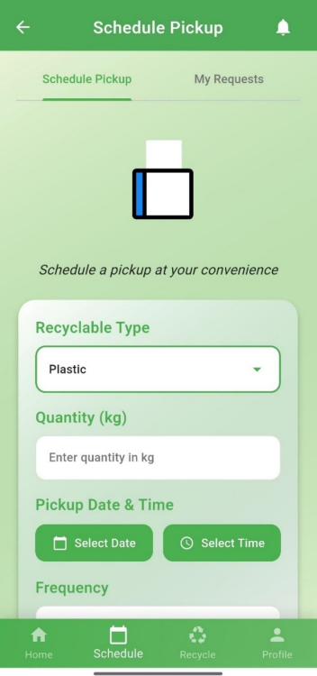
  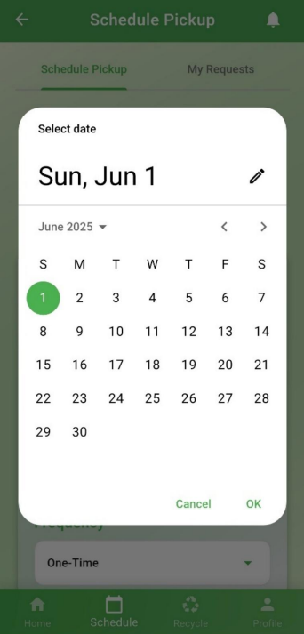
  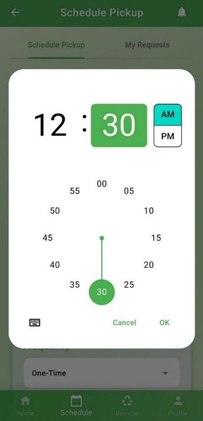

  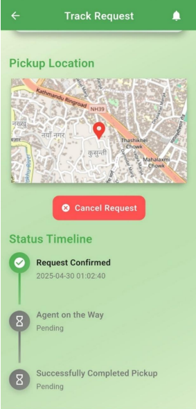
  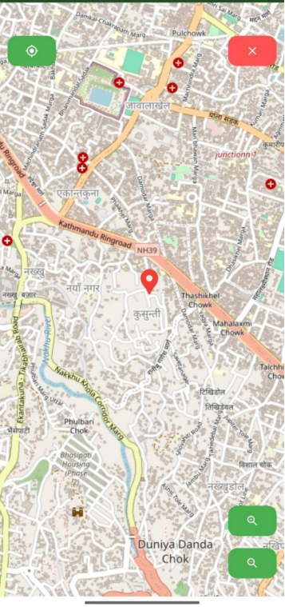
  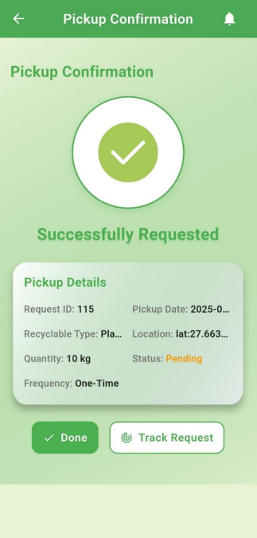

  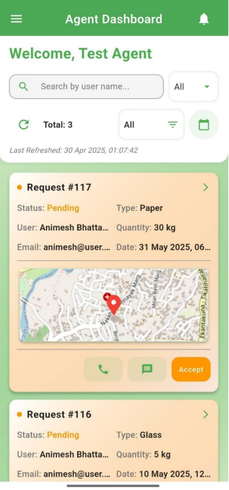
  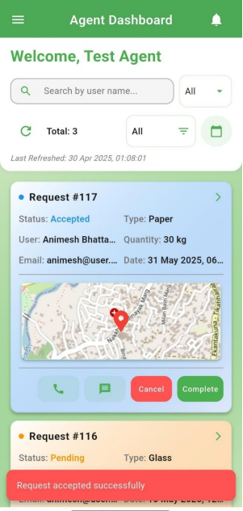

  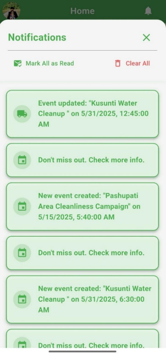
  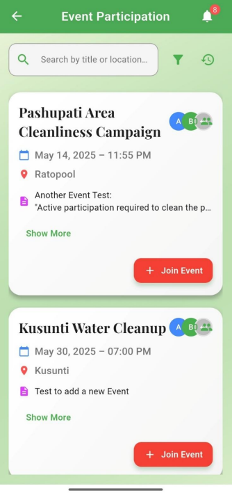

---
